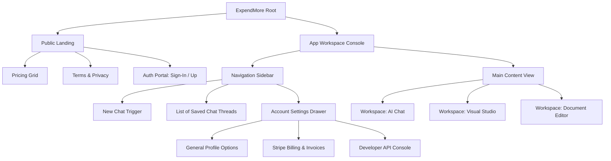
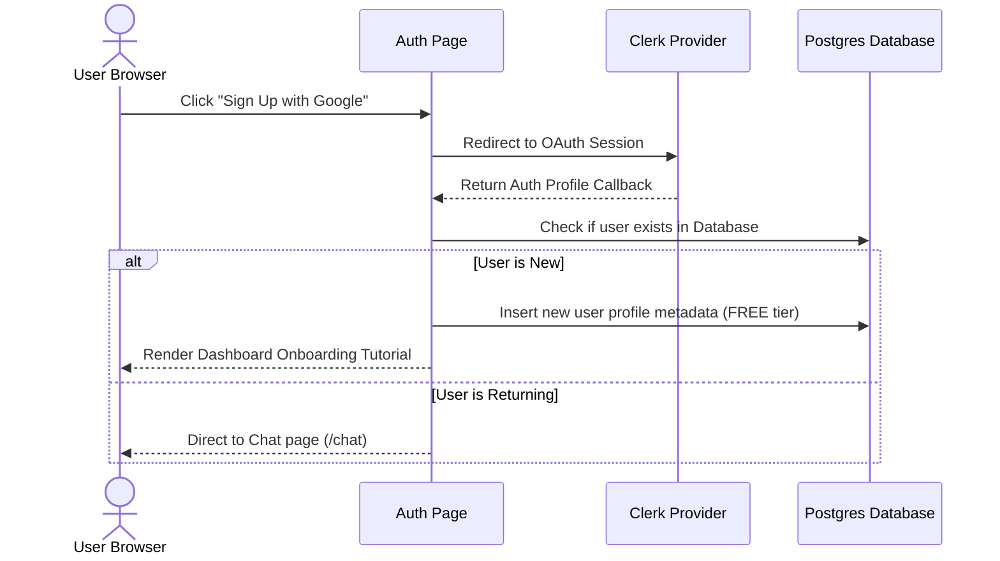
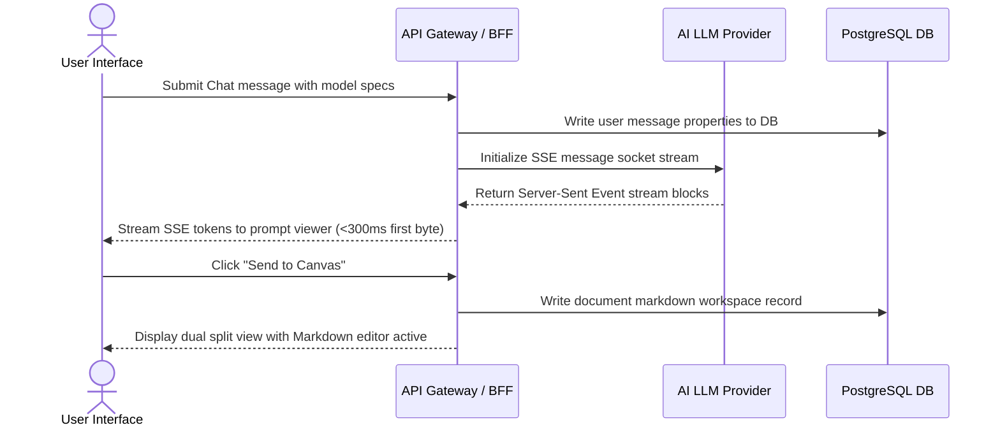
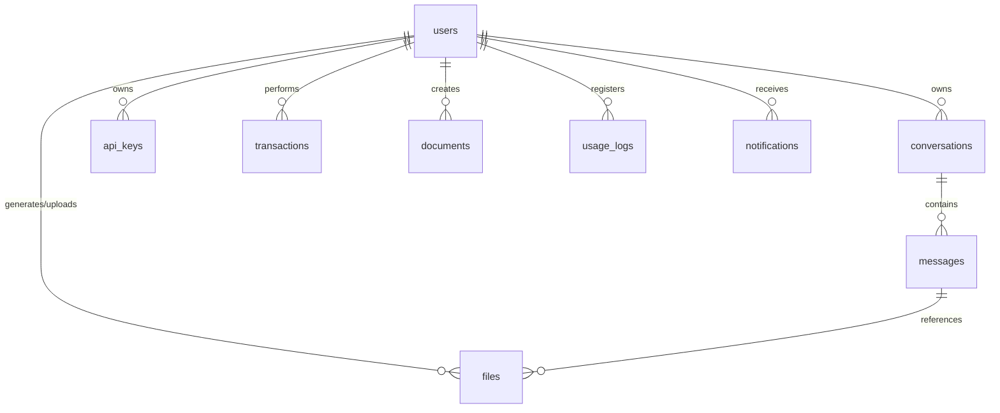

# ExpendMore — Master Product Blueprint (PRD)
### Master Reference Document for Engineering, Design, QA, and DevOps

---

## 1. Product Vision

### 1.1. Mission
ExpendMore's mission is: **"One workspace. Every AI capability. Zero compromise."** We unify fragmented AI utilities (chatbots, image creators, text editors) under a single, premium workspace. 

### 1.2. Long-Term Vision
We intend to transition ExpendMore from an AI interface aggregator into a **unified AI-native operating system**. Over time, ExpendMore will support custom agent loops, private file retrieval networks (RAG), and a developer-driven tool plugin marketplace, serving as the central hub for AI-assisted human creativity and operations.

### 1.3. Core Values
- **Aesthetic Excellence**: Premium styling, glassmorphism, responsive micro-interactions, dark-first priority.
- **Microsecond Performance**: Token streaming start in <300ms, sub-100ms UI transitions.
- **Modularity**: Individual workspaces operate cleanly alone, but unlock extra power when combined.
- **Privacy & Transparency**: Strict Row-Level Security, transparent token usage billing.

### 1.4. Success Metrics (KPIs)

| KPI Category | Metric Name | Definition / Calculation | Target Value |
|---|---|---|---|
| **Product** | **Stream Start Latency** | Time to first token stream (TTFB) | < 300 ms (on 4G) |
| **Product** | **Core Web Vitals LCP** | Largest Contentful Paint time | < 2.5 seconds |
| **User** | **Retention Rate (D30)** | Users returning 30 days after sign-up | > 35% |
| **Business** | **Free-to-Paid Conversion** | Percentage of free users migrating to Pro | > 5% within 6 months |
| **Business** | **Customer Lifetime Value** | Average revenue generated per user | > ₹2,400 ($30 USD) |

---

## 2. Product Goals

### 2.1. Business Goals
- Achieve **₹20,00,000 (~$25,000 USD) Monthly Recurring Revenue (MRR)** within 12 months.
- Scale to **100,000+ registered users** within the first 6 months.
- Establish payment operations inside India (UPI) and globally (Stripe cards).

### 2.2. User Goals
- Eliminate context switching between ChatGPT, Midjourney, and Notion.
- Provide a smooth workspace that works seamlessly across mobile devices and desktops.
- Give users immediate access to advanced AI models (Claude 3.5, GPT-4o) without maintaining separate subscriptions.

### 2.3. Technical Goals
- Build a modular, component-driven frontend architecture utilizing Next.js Server Components.
- Implement token-bucket rate limiting to prevent API billing overruns.
- Deliver an automated model fallback adapter to maintain service availability during upstream provider outages.

---

## 3. Scope Matrix

```text
Product Release Roadmap Scope:
+--------------------------------------------------------------+
| Phase 1 (MVP Scope):                                         |
| -> Clerk Auth (Email / Google), Core Chat Stream,            |
|    Image Generator, Split Canvas Editor, Stripe Billing.     |
+--------------------------------------------------------------+
                               |
                               v
+--------------------------------------------------------------+
| Phase 2 (Post-Launch Scope):                                 |
| -> India WhatsApp OTP Auth, Claude 3.5 Sonnet,               |
|    Developer API Dashboard, UPI payments integration.        |
+--------------------------------------------------------------+
                               |
                               v
+--------------------------------------------------------------+
| Phase 3 (Future Roadmap):                                    |
| -> Team shared workspaces, Custom Agent loops,               |
|    AI audio/video tools, Prompt builders marketplace.        |
+--------------------------------------------------------------+
```

### 3.1. MVP Features (Phase 1)
- **Authentication**: Clerk Email + Google Social Login.
- **AI Chat**: Token-streaming chat interface supporting GPT-4o-mini and Gemini Lite.
- **Image Studio**: Standard image generation form integrated with DALL-E.
- **Rich Document Editor**: Side-by-side split screen Markdown canvas editor.
- **Payments Gateway**: Stripe subscription pricing integration (Standard Card payment support).

### 3.2. Phase 2 Features
- **WhatsApp OTP Integration**: Custom OTP login flow via WhatsApp API.
- **Advanced AI Models**: Model selection support for Claude 3.5 Sonnet and GPT-4o.
- **Developer Hub**: User API key generation, request validation, and logs.
- **UPI Support**: Local payment checkout options for the India market.

### 3.3. Future Roadmap (Phase 3)
- Multi-user collaborative workspaces with real-time editing.
- Automated agent execution workflows.
- Custom system prompt template builder and marketplace.

### 3.4. Out of Scope Items
- Custom training/fine-tuning of LLM checkpoints.
- Executing code directly inside the sandbox browser (no Python execution environment).
- Developing custom database engines (standard Postgres database schemas only).

---

## 4. Target Users & Jobs to be Done (JTBD)

### 4.1. User Personas

#### Persona A: Rohan (The Developer)
* **Profile**: Freelance React/Node developer based in Bangalore.
* **Pain Points**: High cost of maintaining ChatGPT Plus, Claude Pro, and Midjourney accounts separately. Formatting errors when pasting code snippets from chat to documentation.
* **Use Case**: Writes helper functions, resolves syntax bugs, and documents API schemas.

#### Persona B: Priya (The Content Creator)
* **Profile**: Social media marketer and writer.
* **Pain Points**: Sluggish UI on competitor platforms. Poor mobile support for editing text on the go.
* **Use Case**: Generates visual thumbnails, drafts articles, and coordinates client posts from her phone.

---

### 4.2. Jobs to be Done (JTBD)

| Situation | Action / Capability | Intended Outcome |
|---|---|---|
| When draft layout outlines are generated by the AI | I want to click a single action button to load it in a document sidebar | So I can format and export it without copy-paste alignment shifts. |
| When I am working remotely on my mobile phone | I want access to the same chat threads and files as my desktop | So I can resume my writing workflow without interruption. |

---

## 5. Feature Specifications

### 5.1. Feature 1: Sub-300ms AI Chat Streaming (Phase 1 MVP)
- **Purpose**: Low-latency chat interface for real-time AI responses.
- **User Story**: *As a user, I want the AI response to stream in real-time immediately after submission so that I don't wait on bulk outputs.*
- **Acceptance Criteria**:
  - **AC 5.1.1**: Time-to-first-token (TTFB) must be under 300ms on a 4G connection.
  - **AC 5.1.2**: Streaming Markdown must parse code blocks, tables, and standard highlights dynamically.
  - **AC 5.1.3**: The user must be able to cancel generation mid-stream to stop billing consumption.
- **Edge Cases**: Out-of-order token arrival via socket timeouts (must buffer and sort).
- **Dependencies**: Server-Sent Events backend adapter.
- **Priority**: **Must Have**.

---

### 5.2. Feature 2: Side-by-Side Markdown Canvas (Phase 1 MVP)
- **Purpose**: A text editor positioned alongside the chat panel for easy content management.
- **User Story**: *As a writer, I want to display my active document alongside the chat pane so I can edit text while chatting with the AI.*
- **Acceptance Criteria**:
  - **AC 5.2.1**: Clicking "Send to Canvas" opens a 50% split pane on desktop.
  - **AC 5.2.2**: The editor must support basic styling shortcuts (Bold, Italic, Header markdown bindings).
  - **AC 5.2.3**: Changes must auto-save to the database (debounced at 1000ms).
- **Edge Cases**: Unsaved local changes when the network goes offline (must display offline indicators and cache to LocalStorage).
- **Dependencies**: Document database model.
- **Priority**: **Must Have**.

---

### 5.3. Feature 3: WhatsApp OTP Login (Phase 2)
- **Purpose**: Fast login flow optimized for the India market.
- **User Story**: *As a mobile user in India, I want to authenticate using a WhatsApp OTP code so I don't have to manage passwords.*
- **Acceptance Criteria**:
  - **AC 5.3.1**: System sends a 6-digit alphanumeric OTP via WhatsApp verification templates.
  - **AC 5.3.2**: OTP values expire precisely 5 minutes after creation.
  - **AC 5.3.3**: Rate limits restrict requests to 3 attempts within 10 minutes.
- **Edge Cases**: OTP dispatch fails due to provider downtime (must fallback to SMS option after 30 seconds).
- **Dependencies**: Custom Clerk Webhook Auth setup.
- **Priority**: **Should Have**.

---

## 6. Complete Screen Inventory

### 6.1. Public Access Views
1. **Landing/Marketing Page**: Product introduction, pricing cards, feature comparisons, and links to terms.
2. **Sign-In Page**: Forms for Phone OTP, Google OAuth, and Email login.
3. **Sign-Up Page**: Initial onboarding profile setup (name, display picture).
4. **Shared Document View**: A read-only Markdown page for public document links.

### 6.2. Protected Dashboard Views
5. **Main Chat Console**: Active conversation panels, model switchers, and the split document canvas.
6. **Image Generation Panel**: Visual studio interface, settings sidebar, and generated grid gallery.
7. **Document Workspace List**: Grid directory listing all documents owned by the user.

### 6.3. User Settings & Admin Overlays
8. **Billing Dashboard**: Tier management, Stripe checkout redirections, and invoices.
9. **Developer Panel (Phase 2)**: API token generator keys, analytics request logs.
10. **Admin Portal Dashboard**: Admin console showing platform metrics, active server jobs, and user logs.

---

## 7. Navigation Structure & Routes

```text
Routing System:
├── Public Routes (Unprotected)
│   ├── / (Landing Page)
│   ├── /sign-in (Auth portal)
│   ├── /sign-up (Account creation)
│   └── /doc/share/[token] (Read-only Document)
├── Protected Routes (Session Required)
│   ├── /chat (Main Console)
│   ├── /images (Visual Studio)
│   ├── /documents (Markdown directory)
│   └── /settings (General configuration drawer)
└── Admin-Only Routes (Admin Role Required)
    └── /admin/analytics (Global usage portal)
```

---

## 8. Information Architecture



---

## 9. Core User Flows

### 9.1. User Sign-Up & Onboarding



### 9.2. Real-Time Chat & Document Canvas Flow



---

## 10. Database Schema Planning

The Postgres database utilizes relational integrity constraints, indexes, and custom enum definitions for billing plans.

### Entity Relationship Model



### Table Schema Definitions

#### 10.1. Table: `users`
* **Purpose**: User profiles and Stripe subscription states.
* **Fields**:
  - `id` (UUID, Primary Key)
  - `clerk_id` (VARCHAR, Unique, Indexed)
  - `email` (VARCHAR, Unique)
  - `phone_number` (VARCHAR, Unique)
  - `display_name` (VARCHAR)
  - `avatar_url` (TEXT)
  - `tier` (ENUM: 'FREE', 'PRO', 'BUSINESS', 'ENTERPRISE')
  - `stripe_customer_id` (VARCHAR, Unique)
  - `stripe_subscription_id` (VARCHAR, Unique)
  - `created_at` (TIMESTAMP)

#### 10.2. Table: `conversations`
* **Purpose**: Saves chat threads metadata.
* **Fields**:
  - `id` (UUID, Primary Key)
  - `user_id` (UUID, Foreign Key referencing `users.id`)
  - `title` (VARCHAR)
  - `model_provider` (VARCHAR)
  - `model_name` (VARCHAR)
  - `created_at` (TIMESTAMP)

#### 10.3. Table: `messages`
* **Purpose**: Chat history messages records.
* **Fields**:
  - `id` (UUID, Primary Key)
  - `conversation_id` (UUID, Foreign Key referencing `conversations.id`)
  - `role` (VARCHAR: 'user', 'assistant', 'system')
  - `content` (TEXT)
  - `token_count` (INT)
  - `created_at` (TIMESTAMP)

#### 10.4. Table: `api_keys`
* **Purpose**: User developer tokens.
* **Fields**:
  - `id` (UUID, Primary Key)
  - `user_id` (UUID, Foreign Key referencing `users.id`)
  - `key_name` (VARCHAR)
  - `key_prefix` (VARCHAR)
  - `hashed_key` (VARCHAR, Unique)
  - `scopes` (ARRAY of VARCHAR)
  - `is_active` (BOOLEAN)
  - `created_at` (TIMESTAMP)

#### 10.5. Table: `usage_logs`
* **Purpose**: Track API and feature consumption for billing limits.
* **Fields**:
  - `id` (UUID, Primary Key)
  - `user_id` (UUID, Foreign Key referencing `users.id`)
  - `feature_name` (VARCHAR: 'chat', 'image', 'api_request')
  - `units_consumed` (INT)
  - `created_at` (TIMESTAMP)

---

## 11. Authentication & Role Strategy

### 11.1. Auth Providers
1. **Google OAuth**: Primary social login for zero-friction desktop sign-up.
2. **Email OTP**: 6-digit verification code sent via postmaster tools (e.g. Resend).
3. **WhatsApp/Phone OTP (Phase 2)**: WhatsApp verification template callback validation.

### 11.2. Session Management
- Managed via **Clerk JWT tokens**.
- Short-lived JSON Web Tokens (15-minute expiry) are rotated in memory.
- Refresh tokens are stored in secure, `HttpOnly`, `SameSite=Strict`, `Secure` cookies.

### 11.3. Role-Based Access Control (RBAC) Matrix

| Access Role | Available Features | target Routes |
|---|---|---|
| **User (Free)** | Basic Chat, limit checks | `/chat`, `/documents` |
| **User (Premium)** | Advanced models, Image generator, infinite docs | `/chat`, `/images`, `/documents` |
| **Admin** | Database management, billing dashboards | `/admin/*`, `/chat`, `/images` |

---

## 12. Security Requirements

### 12.1. Request Authentication & Validation
- **CORS Configuration**: Restrict API access to verified domains only (e.g. `aisensy.com`).
- **Input Validation**: All incoming API payloads are parsed using Zod schemas to prevent injection attacks.
- **XSS Prevention**: Clean and sanitize Markdown HTML rendering wrappers using DOMPurify libraries.

### 12.2. Rate Limiting System (Redis Token Bucket)

```text
Rate Limiter Configuration:
+-------------------------------------------------------+
| Free Tier: 20 chats/day   | 30 req/min standard       |
+-------------------------------------------------------+
                           |
                           v
+-------------------------------------------------------+
| Pro Tier: Unlimited chats | 120 req/min standard      |
+-------------------------------------------------------+
```

---

## 13. Non-Functional Requirements

### 13.1. Performance & Latency
- First-byte streaming output to clients must start in **<300ms** on 4G networks.
- Next.js layouts load times must achieve **>90** Lighthouse score values.

### 13.2. Accessibility Standards (WCAG 2.1 AA)
- Contrast ratio between text surfaces and backgrounds must exceed **4.5:1** for regular text.
- Reusable components must have full keyboard navigation support and custom aria-label definitions.

### 13.3. SEO Specifications
- Standardized page meta descriptions, titles, OpenGraph image tags, and semantic header structures (exactly one `<h1>` per page).

---

## 14. Technology Stack Justifications

### 14.1. Next.js 15 (App Router)
* **Justification**: React Server Components (RSC) keep bundle sizes small by moving rendering to the server, while server actions simplify data mutation.

### 14.2. Clerk Auth
* **Justification**: Offloads auth security risks, simplifies Google OAuth, and handles session lifecycle management automatically.

### 14.3. Supabase (PostgreSQL)
* **Justification**: Row-Level Security (RLS) simplifies database permissions, while PgBouncer connection pooling ensures database resilience during peak traffic.

### 14.4. Framer Motion
* **Justification**: Provides production-grade spring physics keyframes, page transition layouts, and micro-animations out of the box.

---

## 15. Scalable Project Directory Layout

The workspace conforms to the following directory layout structure:

```text
src/
├── app/
│   ├── layout.tsx             # Global layout & HTML definitions
│   ├── page.tsx               # Main landing marketing views
│   ├── globals.css            # Stylesheets layers & Tailwind classes
│   ├── (auth)/                # Auth route group
│   │   ├── sign-in/
│   │   └── sign-up/
│   └── (dashboard)/           # Dashboard routes
│       ├── chat/
│       ├── images/
│       └── documents/
├── components/
│   ├── ui/                    # Reusable atomic elements (Buttons, Inputs)
│   ├── chat/                  # Chat stream components (PromptBar)
│   ├── gallery/               # Visual grids components (ImageCard)
│   └── canvas/                # Split workspaces (Markdown editor)
├── hooks/
│   ├── use-debounce.ts        # Input delay helpers
│   └── use-chat.ts            # SSE streaming hooks
├── lib/
│   ├── supabase.ts            # Client db connections
│   ├── stripe.ts              # Stripe API parameters
│   └── utils.ts               # Standard tailwind classes merge
└── types/
    └── index.d.ts             # TS declarations structures
```

---

## 16. Coding Standards & Conventions

### 16.1. Code Style Mappings
- **Naming Conventions**:
  - React Component Files: PascalCase (e.g. `PromptBar.tsx`).
  - Standard Functions / Variables: camelCase (e.g. `validateSessionToken()`).
  - Constants / Configurations: UPPERCASE (e.g. `MAX_TOKENS_PER_TIER`).
- **File Organization**: Keep files under 250 lines. Extract complex sub-components into standalone files.

### 16.2. Git Workflow & Semantic Commits
- **Branch Flow**:
  - `main`: Release-ready code only.
  - `staging`: Release candidate staging environment testing.
  - `dev`: Primary integration branch.
  - `feature/*` or `bugfix/*`: Developer isolated code workspaces.
- **Commit Format**: Follow Conventional Commits rules:
  - `feat(chat): add streaming cancel action button`
  - `fix(auth): resolve signup session tokens cookie leakage`
  - `docs(api): update sitemap routes parameters documentation`

---

## 17. Risks & Assumptions

| Risk Identified | Impact | Probability | Mitigation Strategy |
|---|---|---|---|
| Downstream LLM API outages (OpenAI down) | High | Medium | Automated failover model fallback adapters (switch to Gemini). |
| Sudden surge in API token billing costs | High | Low | Enforce daily rate limits and max-token request caps at the API Gateway. |
| User drops off during OTP verification | Medium | High | Send fallback SMS verification templates automatically if WhatsApp dispatch fails. |

---

## 18. Milestone Roadmap

```text
Development Implementation Phases:
+--------------------------------------------------------------+
| Phase 1: MVP Scaffolding & Setup (Weeks 1-3)                  |
| - Directory folder creations, Clerk auth integration.         |
+--------------------------------------------------------------+
                               |
                               v
+--------------------------------------------------------------+
| Phase 2: Core Features & Streaming (Weeks 4-6)               |
| - SSE token parser setups, visual image generators.          |
+--------------------------------------------------------------+
                               |
                               v
+--------------------------------------------------------------+
| Phase 3: Stripe Billing & Polish (Weeks 7-9)                 |
| - Subscription gateways webhooks, UX transitions.            |
+--------------------------------------------------------------+
```

---

## 19. Deliverables (Phase 1 MVP)

At the completion of the Phase 1 build, the repository must contain:
1. Complete Next.js App Router codebase with functional routing setups.
2. Verified Google OAuth and Email login flows via Clerk.
3. Chat stream view rendering real-time assistant responses.
4. Image Studio page dispatching generation jobs.
5. Dual-pane Markdown document workspace with local auto-save features.
6. Stripe Payment webhook listener endpoints capturing billing updates.

---

## 20. Launch Acceptance Criteria

The release branch will be approved for production launch when it meets the following criteria:

- **AC 20.1**: Unit and E2E test coverage exceeds **80%** across frontend utils and backend controllers.
- **AC 20.2**: Desktop and mobile Lighthouse performance scores exceed **90** on staging environments.
- **AC 20.3**: E2E verification confirms successful checkout, subscription status updates, and session expiration limits.
- **AC 20.4**: Security validation checks confirm database RLS is active and CORS origins are locked.
- **AC 20.5**: Uptime validation tests confirm model routing fallback adapter triggers successfully during simulated downstream outages.
